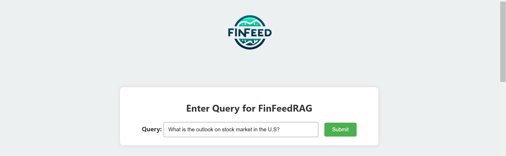

# FinFeed RAG ChatBot
This project aims to develop an AI assistant that efficiently aggregates current news related to finance, economy, and politics from YouTube news channels within a specified timeframe. The assistant allows users to inquire about recent economic news and receive responses through a Retrieval-Augmented Generation (RAG) system. The system simultaneously presents a dynamic  sentiment graph for each context relevant to the query and examines public opinions derived from YouTube comments.
## Authors: 
Aryama Singh (as3844@cornell.edu), Diliya Yalikun (adamliya98@gmail.com), Korel Gundem (korelgundem@gwmail.gwu.edu), Nazanin Komeilizadeh, Roberto Nunez (robertonunezch@gmail.com).
## Modeling Approach

<figure>
  
  <dive style="text-align:center;"><strong>Figure 1: Architecture of FinFeed.</strong>

</figure>

In our modelling approach, chaining and context transmission to the LLM model is crucial for generating precise responses. After preprocessing and vectorizing text chunks, embeddings are stored in a Pinecone vector database. Upon receiving a user query, we use cosine similarity to identify and rank the most relevant text chunks efficiently.
These top-matching chunks are then chained together to form a cohesive context. LangChain, a framework for building applications with language models, facilitates this process by seamlessly integrating different components and ensuring efficient data flow.
The curated context is then sent to our LLM model, GPT-3.5 Turbo, chosen for its advanced natural language capabilities. By providing the model with rich and relevant input, we ensure accurate and contextually appropriate responses. LangChain and the vector database work together to maintain a dynamic and responsive system, meeting high standards of information accuracy and relevance.

### Sentiment Analysis on the comments
We wanted to analyze people’s reaction to the current news. We achieved this by passing the comments as context to our LLM model (chat gpt 3.5 turbo) and prompted it to return the sentiments of the people based on the following schema:

* **General Sentiment**: It gives the general sentiment of the comment either Positive, Neutral or Negative.
* **Aggressiveness Score**:  It defines the tone of the language used between 0 to 5, ranging from least aggressive to most aggressive.
* **General Political Tendency**: It defines a general political leaning of the comment and justifies the reasoning.

### Sentiment Analysis on the context 
We evaluated pre-trained LLM models for financial sentiment analysis, including FinancialBERT, ProsusAI/finbert, and GPT-3.5 Turbo, using a [pre-labeled Kaggle dataset](https://www.kaggle.com/datasets/ankurzing/sentiment-analysis-for-financial-news). Accuracy scores were used to rank their performance.
This helped us identify the best model for sentiment analysis of our text chunks. The attached table shows the accuracy scores of FinancialBERT, ProsusAI/finbert, and GPT-3.5 Turbo on the Kaggle dataset
| Model    | FinancialBERT | ProsusAI/finbert | GPT-3.5 |
|----------|---------------|------------------|---------|
| Accuracy |      79%      |        89%       |    71%  |

## Evaluation
To evaluate our models, we asked GPT-3.5 Turbo to generate 50 finance-related questions. We then used these questions to benchmark GPT-3.5 Turbo (our baseline) and our specialized model, FinFeed.
Next, GPT-4.0 acted as an impartial evaluator, using a specific prompt to choose the most relevant answers between the two models. This comparison allowed us to determine which model—GPT-3.5 Turbo or FinFeed—provided the most accurate and relevant responses.
This process helped us benchmark our specialized model against a strong baseline, ensuring effective financial information delivery. The plot below shows the comparison between GPT-3.5 Turbo and FinFeed.

<figcaption style="text-align:center;"><strong>Figure 2: Our model vs a baseline model performance</strong></figcaption>

## Results
Using the above modeling approach and framework, this chatbot delivers the most current information in financial fields with proper citations. It also provides users with dynamic sentiment graphs for each context (news) based on the prompted query and analyzes the sentiments associated with public opinions on that news. We also developed a web app that interacts with users based on their queries. The chatbot's responses are then derived from the latest financial news.

## Challenges and Possible Solutions
- **Transcription**: Transcribing audio files took a long time since we were doing it locally using only our CPU. We used async IO, a concurrent programming technique that allows us to handle multiple tasks. 
- **Upserting metadata**: Pinecone doesn’t provide a straightforward function to get vector ids. We had to collect all ids and match it with the source transcription file to update it with YT metadata.
- **Prompt templates**: Prompting is a crucial component in creating a RAG system. Since our system involved multiple LLMs, we employed various prompt techniques for different tasks. We experimented extensively with techniques such as Zero-Shot, One-Shot, and Chain-of-Thought prompting. Ultimately, Chain-of-Thought prompting yielded the best performance, particularly for sentiment analysis.
- **Chaining of Multiple LLMs**: Chaining multiple LLMs in a RAG system introduced several challenges, such as increased latency, inconsistent outputs, and compounded errors. To mitigate this, parallel processing and optimizing model efficiency were employed. Inconsistent outputs were addressed by implementing robust validation and consensus mechanisms. Compounded errors escalated through the chain, necessitating error correction protocols and redundancy checks to ensure the reliability and accuracy of the final output. We are still working on this.

## Future Directions
Since our data collection from YouTube encompasses a wide variety of topics, our framework can be adapted to different subjects by altering its knowledge base, and a multimodal approach can be integrated at the initial data processing step to enhance the product's sophistication. We can further augment our model by:
* Making our current Chatbot multimodal by incorporating images generated from the videos and updating their embeddings to Pinecone index, based on transcription timestamps.
* Including an audio assistant to take input questions as audio and also output the generated answers as audio.
* Using BERTopic to cluster documents of similar topics together
* Using SERPs (Scrape Google Search Results) based on the user question, to augment the context data.

## Snippets of our webpage
 
 

<figcaption style="text-align:center;"><strong>Figure 3: FinFeed RAG Chatbot Webpage </strong></figcaption>

## FinFeed conda environment

You should set up a finfeed conda environment and run all of the notebooks with this environment.
To activate finfeed enivironment:

    conda activate finfeed_env

To check everything is there:

    conda list

Should show all of the packages!